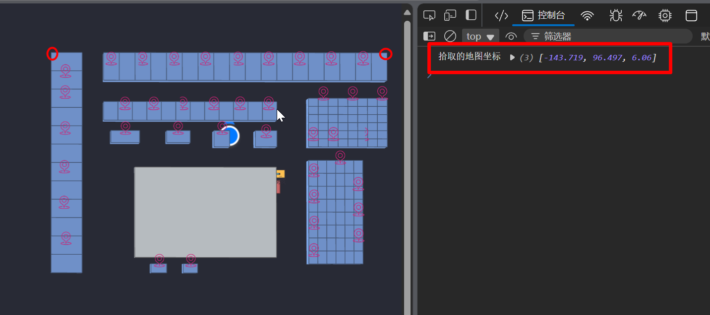

## 经纬度坐标与ooomap平面坐标的映射

ooomap地图坐标采用**两点坐标映射法**,可以简单快捷的完成与经纬度之间的坐标映射关系 

#### 一. 拾取ooomap地图坐标点

1. 在ooomap地图上,找到两个关键点, 并在地图上点击, 因为注册了地图点击事件,所以可以在控制台中获取点击位的地图坐标点
   
2. 构建坐标映射所需的ooomap地图坐标数据
   
   其中 `center` 为第一个点的坐标数组, `x_pos` 为`横坐标第二个点`的坐标数组

#### 二. 拾取对应的GPS经纬度坐标

1. 在[腾讯地图](https://lbs.qq.com/getPoint/)拾取与ooomap地图坐标点对应的经纬度坐标点

    > 这两上坐标点不需要是水平的. 可以为任意角度的. SDK中会自动的进行旋转与缩放的适配

    

2. 构建坐标映射所需要的经纬度坐标数据

    **注意**: 这里需要使用SDK提供的坐标将经纬度(lng,lat)转为`墨卡托坐标`, **经度在前,纬度在后**

    

3. 使用 `om.CoordProjection` 类构建坐标映射实例

    

    使用 `cp.realToMap` 方法完成从经纬度坐标到ooomap地图坐标的转换, 返回类型为 `Vector3` 类型, 这里因为需要 从 `经纬度` -> `web墨卡托` -> `ooomap平面坐标` 的转化, 所以可以将这个过程封装成一个方法 `transCoord(lng, lat)` 

    同理可以使用 `cp.mapToReal` 方法完成从ooomap地图坐标到经纬度坐标的转换, 返回的是`Vector3`类型的墨卡托坐标
    
    可以再通过 `om.utils.coordTransform.mercatorToLngLat( p.x, p.y )` 方法将墨卡托坐标转化为经纬度坐标 
 